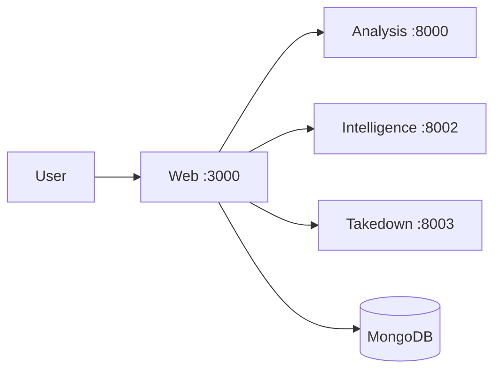

# algorithm-x (Sniffer stack)

Hackathon monorepo: **Next.js** web app at the repo root plus three **FastAPI** services under `services/`. Image authenticity analysis, domain intelligence, and takedown guidance.

Longer design notes: [detail.md](detail.md)

## Overview

1. Create a case.  
2. Upload suspicious image (optional reference).  
3. Run analysis.  
4. Call intelligence and takedown APIs.  
5. View report and dashboard.

## Architecture



## Repository layout

```text
app/ components/ lib/ types/   Next.js + API routes (repo root)
services/analysis/              FastAPI analysis
services/intelligence/          FastAPI intelligence
services/takedown/             FastAPI takedown + dataset.csv
scripts/run-service.cjs        Dev runner for Python services
scripts/setup-python-venv.cjs  One-shot venv + pip install
```

## Prerequisites

- Node.js 20+
- pnpm 9+
- Python 3.11+
- MongoDB (local or remote) for cases / dashboard

## Quick start

```bash
pnpm install
copy .env.example .env.local   # Windows — or: cp .env.example .env.local
# Edit .env.local — set MONGODB_URI and secrets as needed.

pnpm install:py                # creates services/.venv and pip-installs all three services
pnpm dev                       # web + all three APIs (see package.json scripts)
```

**Web only (no Python):** `pnpm dev:web`  
**Services only:** `pnpm dev:services` (activate `services/.venv` first so `python` is on PATH for the runners, or rely on your global Python if requirements are installed)

Manual venv (alternative to `install:py`):

```bash
cd services
python -m venv .venv
# Windows: .venv\Scripts\activate  |  macOS/Linux: source .venv/bin/activate
pip install -r analysis/requirements.txt
pip install -r intelligence/requirements.txt
pip install -r takedown/requirements.txt
cd ..
pnpm dev
```

### Ports

| Service     | Port |
|------------|------|
| Web        | 3000 |
| Analysis   | 8000 |
| Intelligence | 8002 |
| Takedown   | 8003 |

## Environment variables

### Web (`.env.local`)

Copy from [.env.example](.env.example).

**Required for full features:** `MONGODB_URI`, `NEXT_PUBLIC_API_URL`, `INTELLIGENCE_SERVICE_URL`, `TAKEDOWN_SERVICE_URL`, `NEXTAUTH_URL`, `NEXTAUTH_SECRET`

**Optional (magic-link email):** `EMAIL_SERVER_*`, `EMAIL_FROM`

Committed **[.env.production](.env.production)** holds non-secret placeholders so `pnpm build` works without a local file. Override in production with `.env.production.local`.

### Analysis (`services/analysis/.env`)

See `services/analysis/.env.example` — e.g. `HF_TOKEN` if a model needs it.

### Intelligence / Takedown

Optional: `INTELLIGENCE_PORT`, `TAKEDOWN_PORT`, `ALLOWED_ORIGINS`, data paths — see each service’s `config.py`.

## API reference (high level)

### Analysis (`:8000`)

`POST /api/cases/`, `GET /api/cases/{case_id}`, analysis and discovery routes, registry, `GET /api/dashboard/`, `GET /health`

### Intelligence (`:8002`)

`GET /api/v1/intelligence/{domain}`, `GET /health`

### Takedown (`:8003`)

`GET /api/v1/takedown/{domain}`, `GET /health`

### Next.js API routes

`/api/cases/*`, `/api/intelligence/[domain]`, `/api/takedown/[domain]`, `/api/user/cases`, `/api/dashboard/overview`, etc.

## Build

```bash
pnpm build
pnpm start             # production web; use `pnpm start` script for full stack if configured
```

## License / attribution

Product UI and flows are Sniffer-derived; hackathon tree lives under **algorithm-x** with flat web layout and `pnpm` workspaces for `services/*`.
